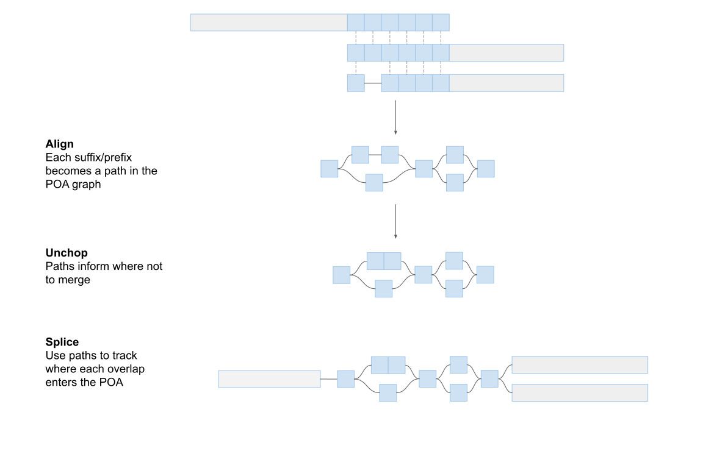
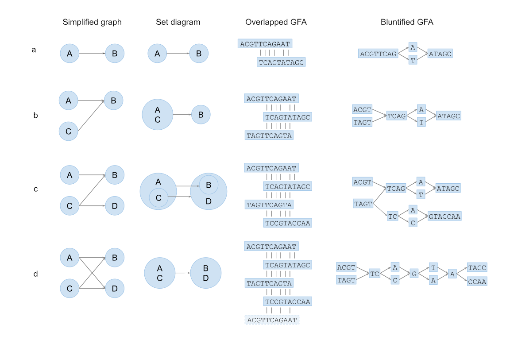

# GetBlunted

For converting GFAs with overlapped sequences into blunt-ended GFAs with no overlaps.

## Method

Overlaps are resolved using POA, as in the following diagram:


The way that we resolve overlaps is designed to provide two guarantees. First, all two-hop adjacencies are preserved (i.e. if `A > B > C` is a walk in the input, that walk will be preserved in the output). This is the extent of adjacency information described in the link lines of the GFA. Second, no single-hop adjacencies are created that are not present in the input. False single-hop adjacencies are a risk when merged overlapped sequences in adjacency components are not fully connected (case C). To accomplish these two goals, it is sometimes necessary to duplicate portions of input sequences in the output. A table describing the provenance of the output sequences can optionally be produced alongside the output GFA.


## Usage

```./get_blunted [-p provenance_table.txt] input.gfa > bluntified.gfa```

For a typical phased human assembly GFA (5.1GB) about 8GB of RAM are used, and run time is 1m 30s.

## Installation

GetBlunted is compatible with Ubuntu (tested on 18.04) and MacOS (tested on 10.14.6)

External dependencies: `libomp`, `cmake`

1. Clone the repo and `cd GetBlunted/`
2. `mkdir build`
3. `cd build`
4. `cmake ..`
5. `make -j [n_threads]`

Currently there is no make install step, so the executable is found in`GetBlunted/build/`
